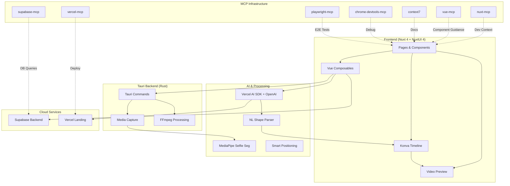

# ClipForge Implementation Tasks

Each task represents a PR that will be created during development.

## Architecture Overview

## Phase 1: Foundation & MCP Setup

### PR-1: Project Initialization
**Description:** Initialize ClipForge from Nuxtor template with TypeScript, ESLint, Tailwind, and create `.cursorrules` emphasizing MCP usage.

**Tasks:**
- [x] Run `npx degit NicolaSpadari/nuxtor clipforge`
- [x] Configure Bun package manager
- [x] Set up TypeScript configuration
- [x] Configure ESLint
- [x] Configure TailwindCSS
- [x] Create `.cursorrules` file emphasizing MCP for all Nuxt/NuxtUI work
- [x] Update PRD to emphasize MCP as critical infrastructure

**Files to Create:**
- `.cursorrules`
- `package.json` (update with ClipForge name)
- `tsconfig.json` (verify config)
- `tailwind.config.js` (verify config)

### PR-2: MCP Infrastructure Setup
**Description:** Set up all 7 MCP servers for development assistance.

**Tasks:**
- [x] Install MCP servers (used available packages: @socketsecurity/mcp, @modelcontextprotocol/sdk, @playwright/test)
- [x] Create `.cursor/mcp.json` configuration file
- [x] Document MCP setup in docs/mcp-setup.md

**Files to Create:**
- `.cursor/mcp.json`
- `docs/mcp-setup.md`

### PR-3: Core Dependencies
**Description:** Install all core dependencies for video editing, timeline, and processing.

**Tasks:**
- [x] Add `@ffmpeg/ffmpeg` for video processing
- [x] Add `konva` and `vue-konva` for timeline canvas
- [x] Add `@tensorflow/tfjs` and `@tensorflow-models/body-segmentation` for face/body segmentation (replaces @mediapipe/selfie)
- [x] Add `plyr` for video player controls
- [x] Add `@supabase/supabase-js` for backend
- [x] Add `ai` (Vercel AI SDK) for AI features
- [x] Add `openai` for OpenAI integration
- [x] Configure Tauri permissions in `src-tauri/capabilities/main.json`

**Files to Modify:**
- `package.json`
- `src-tauri/capabilities/main.json`

## Phase 2: Supabase Backend & Auth

### PR-4: Supabase Schema & Auth
**Description:** Set up Supabase tables and OAuth authentication flow.

**Tasks:**
- [x] Create Supabase tables: `projects`, `clips`, `pip_configs`
- [x] Set up Row Level Security (RLS) policies
- [x] Implement OAuth authentication (GitHub/Google)
- [x] Create auth components using NuxtUI (via vue-mcp guidance)
- [x] Add user profile management (basic)
- [x] Create `composables/useAuth.ts` for auth state

**Files to Create:**
- `composables/useAuth.ts`
- `components/auth/LoginForm.vue`
- `components/auth/UserProfile.vue`
- SQL migration files in Supabase

**Files to Modify:**
- `pages/index.vue`
- `.env` (add Supabase keys)

### PR-5: Project Cloud Sync
**Description:** Implement local-first cloud sync using Vue composables (not Pinia).

**Tasks:**
- [x] Create `composables/useProject.ts` for project state management
- [x] Create `composables/useClips.ts` for clips management
- [x] Create `composables/useTimeline.ts` for timeline state
- [x] Implement auto-save to Supabase (project metadata only)
- [x] Add conflict resolution for multi-device edits
- [x] Create local-first architecture with cloud backup
- [x] Test sync functionality (basic implementation)

**Files to Create:**
- `composables/useProject.ts`
- `composables/useClips.ts`
- `composables/useTimeline.ts`
- `utils/sync.ts`

## Phase 3: Media Import & Management

### PR-6: File Import System
**Description:** Build drag-and-drop file import with thumbnail generation.

**Tasks:**
- [x] Create drag-and-drop interface using NuxtUI components (via vue-mcp)
- [x] Implement file picker for MP4/MOV/WebM
- [x] Generate video thumbnails using canvas
- [x] Create media library UI with grid view
- [x] Store file metadata in composable state

**Files to Create:**
- `composables/useMedia.ts`
- `components/library/MediaLibrary.vue`
- `components/library/MediaThumbnail.vue`
- `pages/library.vue`

### PR-7: Tauri Media Commands
**Description:** Create Rust commands for file system and media handling.

**Tasks:**
- [x] Create Rust commands for file system access
- [x] Implement media file validation
- [x] Add metadata extraction (duration, resolution, codec)
- [x] Create temp file management for recordings
- [x] Handle file path conversions using Tauri FS API

**Files to Create:**
- `src-tauri/src/commands/media.rs`
- [x] Update `src-tauri/src/main.rs` to register commands

## Phase 4: Basic Video Preview & Playback

### PR-8: Video Player Component
**Description:** Create HTML5 video player with controls.

**Tasks:**
- [x] Create HTML5 video player with Plyr controls
- [x] Implement play/pause/scrub functionality
- [x] Add frame-accurate seeking
- [x] Create current time display
- [x] Sync with composable state playhead position

**Files to Create:**
- `composables/usePlayer.ts`
- `components/player/VideoPreview.vue`
- `components/player/Controls.vue`

### PR-9: Timeline Foundation
**Description:** Set up Konva.js canvas for timeline interface.

**Tasks:**
- [x] Set up Konva.js canvas for timeline
- [x] Create horizontal timeline with zoom controls
- [x] Implement ruler/timecode display
- [x] Add clip thumbnail rendering on timeline (basic)
- [x] Create draggable clip functionality (basic)

**Files to Create:**
- `composables/useZoom.ts`
- `components/timeline/Timeline.vue`
- `components/timeline/Ruler.vue`

## Phase 5: PiP Magic - Core Features

### PR-10: MediaPipe Integration
**Description:** Integrate MediaPipe for face detection and basic PiP masking.

**Tasks:**
- [x] Integrate TensorFlow.js Body Segmentation (replaces MediaPipe Selfie)
- [x] Create face detection on video import
- [x] Implement basic circular mask with `clip-path`
- [x] Auto-detect webcam footage vs screen recording
- [x] Create PiP preview overlay on video player

**Files to Create:**
- `composables/useMediaPipe.ts`
- `composables/usePipMask.ts`
- `components/pip/PipOverlay.vue`

### PR-11: Natural Language Shape Parser with AI
**Description:** Build hybrid AI-powered shape parser using Vercel AI SDK + OpenAI.

**Tasks:**
- [x] Create predefined shape library (circle, square, heart, hex, star, diamond, triangle, pentagon, octagon, ellipse)
- [x] Implement `composables/useAI.ts` with OpenAI
- [x] Integrate OpenAI API for shape generation
- [x] Build LLM prompt parser for variations ("spiky circle" → circle with border effects)
- [x] Create SVG path generator for custom shapes
- [x] Add fallback to circle for unparseable inputs
- [x] Create shape preview UI with NuxtUI components

**Files to Create:**
- `composables/useAI.ts`
- `utils/shapes.ts`
- `utils/svg-generator.ts`
- `components/pip/ShapeParser.vue`
- `components/pip/ShapePreview.vue`
- `components/pip/AIShapeInput.vue`

**Environment Variables:**
- `OPENAI_API_KEY` in `.env`

### PR-12: Smart PiP Positioning
**Description:** Implement intelligent auto-positioning for PiP overlay.

**Tasks:**
- [ ] Implement heuristics for corner placement
- Analyze frame for high-motion areas (avoid those)
- Detect text/UI hotspots in screen recordings
- [ ] Create auto-positioning algorithm
- Allow manual override with drag-and-drop

**Files to Create:**
- `utils/positioning.ts`
- `composables/usePipPosition.ts`
- [ ] Update `components/pip/PipOverlay.vue`

## Phase 6: Timeline Editor - Full Features

### PR-13: Multi-Track Timeline
**Description:** Build multi-track timeline system with track controls.

**Tasks:**
- [ ] Create 2-track system (main video + PiP overlay)
- [ ] Implement clip stacking and ordering
- [ ] Add track muting/soloing
- [ ] Create snap-to-grid functionality
- [ ] Add keyboard shortcuts (Space=play, I/O=trim points)

**Files to Create:**
- `components/timeline/Track.vue`
- `components/timeline/Clip.vue`
- `utils/keyboard-shortcuts.ts`
- [ ] Update `composables/useTimeline.ts`

### PR-14: Clip Editing Operations
**Description:** Implement trim, split, delete, and undo/redo operations.

**Tasks:**
- [ ] Implement trim (in/out points)
- [ ] Add split clip functionality
- [ ] Create delete/duplicate operations
- [ ] Implement undo/redo stack
- [ ] Add clip arrangement (reorder, move between tracks)

**Files to Create:**
- `composables/useClipEditing.ts`
- `composables/useUndoRedo.ts`
- `utils/clip-operations.ts`

### PR-15: PiP Timeline Controls
**Description:** Create PiP controls with animation support.

**Tasks:**
- [ ] Create PiP resize handles on timeline
- [ ] Implement position keyframing
- [ ] Add shape editing from timeline
- [ ] Create shape animation controls (pulse, rotate, scale)
- Link to audio peaks for reactive animations

**Files to Create:**
- `components/timeline/PipControls.vue`
- `composables/usePipAnimation.ts`
- `composables/useAudioPeaks.ts`
- [ ] Update `composables/usePipMask.ts`

## Phase 7: Recording Capabilities

### PR-16: Screen Recording
**Description:** Implement screen capture using Tauri.

**Tasks:**
- [ ] Implement Tauri getDisplayMedia for screen capture
- [ ] Add full screen vs window selection
- [ ] Create recording controls UI (record/stop buttons)
- [ ] Show recording indicator and timer
- Save recording to temp folder automatically

**Files to Create:**
- `composables/useScreenCapture.ts`
- `components/recorder/RecordingControls.vue`
- `src-tauri/src/commands/recording.rs`
- `pages/recorder.vue`

### PR-17: Webcam Recording
**Description:** Add webcam capture with auto-PiP application.

**Tasks:**
- [ ] Implement getUserMedia for camera access
- [ ] Create webcam preview during recording
- Auto-apply circular PiP mask on capture
- Allow natural language shape override before recording
- Combine screen + webcam into single recording session

**Files to Create:**
- `composables/useWebcamCapture.ts`
- `components/recorder/WebcamPreview.vue`
- [ ] Update `pages/recorder.vue`

### PR-18: Audio Recording
**Description:** Implement audio capture with visualization.

**Tasks:**
- [ ] Add microphone input capture
- [ ] Implement audio level meters
- [ ] Create audio waveform preview
- Sync audio with video tracks
- [ ] Add audio trimming capabilities

**Files to Create:**
- `composables/useAudioCapture.ts`
- `components/recorder/AudioMeter.vue`
- `components/recorder/Waveform.vue`
- `composables/useAudioPeaks.ts`

## Phase 8: Advanced PiP Features

### PR-19: PiP Animation System
**Description:** Build animation system with speech-triggered effects.

**Tasks:**
- [ ] Create animation timeline for PiP properties
- [ ] Implement speech-triggered effects (Web Audio API)
- [ ] Add border glow on audio peaks
- [ ] Create subtle shape morphing
- [ ] Add entrance/exit animations

**Files to Create:**
- `composables/usePipAnimation.ts`
- `utils/animation-easing.ts`
- `components/pip/AnimationEditor.vue`
- [ ] Update `composables/useAudioPeaks.ts`

### PR-20: Shape Customization UI
**Description:** Create UI for shape customization and presets.

**Tasks:**
- [ ] Create shape editor panel (NuxtUI form components)
- [ ] Add border color/width controls
- [ ] Implement shadow effects
- [ ] Create shape presets gallery
- Allow saving custom shapes to library

**Files to Create:**
- `components/pip/ShapeEditor.vue`
- `components/pip/PresetsGallery.vue`
- `composables/useShapePresets.ts`

## Phase 9: Export & FFmpeg Integration

### PR-21: FFmpeg Export Pipeline
**Description:** Set up FFmpeg for video export with PiP compositing.

**Tasks:**
- Set up @ffmpeg/ffmpeg WASM
- [ ] Implement clip stitching
- [ ] Add trim point application
- [ ] Create PiP compositing with dynamic clip-path
- Generate MP4 with proper codec settings

**Files to Create:**
- `composables/useFFmpeg.ts`
- `utils/ffmpeg-operations.ts`
- `utils/video-compositor.ts`

### PR-22: Export UI & Progress
**Description:** Create export UI with progress tracking.

**Tasks:**
- [ ] Create export dialog with resolution options (720p/1080p)
- [ ] Implement progress bar with percentage
- [ ] Add export queue for multiple exports
- [ ] Create export presets (web, YouTube, high quality)
- Save exported files with Tauri save dialog

**Files to Create:**
- `components/export/ExportDialog.vue`
- `components/export/ProgressBar.vue`
- `composables/useExport.ts`

### PR-23: Export Quality & Optimization
**Description:** Optimize export for quality and performance.

**Tasks:**
- [ ] Implement 60fps export capability
- [ ] Add bitrate controls
- [ ] Create audio mixing/normalization
- Optimize export speed (multi-threading where possible)
- [ ] Add export preview before final render

**Files to Create:**
- `utils/export-presets.ts`
- `utils/audio-processing.ts`
- [ ] Update `composables/useFFmpeg.ts`

## Phase 10: Polish & Performance

### PR-24: Performance Optimization
**Description:** Optimize for 60fps preview and <4s launch time.

**Tasks:**
- [ ] Implement 60fps PiP preview rendering
- Optimize Konva timeline for 10+ clips
- [ ] Add lazy loading for thumbnails
- [ ] Create memory leak detection and fixes
- Achieve <4s launch time

**Files to Create:**
- `utils/performance-monitor.ts`
- [ ] Update multiple files with performance optimizations

### PR-25: Accessibility
**Description:** Implement accessibility features throughout app.

**Tasks:**
- [ ] Add keyboard navigation for all features
- [ ] Implement ARIA labels for controls
- [ ] Create high-contrast mode using NuxtUI
- [ ] Add screen reader support
- [ ] Test with accessibility tools

**Files to Create:**
- `utils/a11y.ts`
- [ ] Update all components with ARIA labels

### PR-26: Error Handling & Validation
**Description:** Add comprehensive error handling.

**Tasks:**
- [ ] Add comprehensive error boundaries
- [ ] Create user-friendly error messages
- [ ] Implement file format validation
- [ ] Add retry logic for failed operations
- [ ] Create debug logging system

**Files to Create:**
- `composables/useError.ts`
- `components/ErrorBoundary.vue`
- `utils/validation.ts`
- `utils/logger.ts`

## Phase 11: Testing & Quality Assurance

### PR-27: E2E Tests with Playwright
**Description:** Create comprehensive E2E test suite.

**Tasks:**
- [ ] Create test suite using playwright-mcp
- [ ] Test: Record → shape input → PiP → timeline → export
- [ ] Test: Import 3 clips → arrange → split → export
- [ ] Test: Natural language shape parsing
- [ ] Test: Supabase sync functionality

**Files to Create:**
- `tests/e2e/recording.spec.ts`
- `tests/e2e/editing.spec.ts`
- `tests/e2e/export.spec.ts`
- `tests/e2e/pip.spec.ts`
- `tests/e2e/sync.spec.ts`

### PR-28: Integration Testing
**Description:** Test integration between all systems.

**Tasks:**
- [ ] Test FFmpeg export pipeline
- [ ] Test MediaPipe face detection accuracy
- [ ] Test shape parser with 50+ inputs
- [ ] Test timeline performance with large projects
- [ ] Test cloud sync edge cases

**Files to Create:**
- `tests/integration/ffmpeg.spec.ts`
- `tests/integration/ai.spec.ts`
- `tests/integration/mediapipe.spec.ts`

### PR-29: Cross-Platform Testing
**Description:** Build and test on macOS and Windows.

**Tasks:**
- [ ] Build and test on macOS (.dmg)
- [ ] Build and test on Windows (.exe)
- [ ] Test on different screen resolutions
- [ ] Verify all media formats (MP4/MOV/WebM)
- [ ] Test with chrome-devtools-mcp for browser issues

**Commands to Run:**
- `bun run tauri:build --target x86_64-apple-darwin`
- `bun run tauri:build --target x86_64-pc-windows-msvc`

## Phase 12: Landing Page & Marketing

### PR-30: Vercel Landing Page
**Description:** Create landing page with demo and downloads.

**Tasks:**
- [ ] Create Next.js landing page
- [ ] Add demo video embed (screen recording with PiP Magic)
- [ ] Create feature showcase section
- [ ] Add download buttons for macOS/Windows
- [ ] Deploy via vercel-mcp with auto-previews

**Files to Create:**
- `landing/package.json`
- `landing/pages/index.tsx`
- `landing/components/DemoVideo.tsx`
- `landing/components/DownloadButtons.tsx`

### PR-31: Documentation
**Description:** Write comprehensive documentation.

**Tasks:**
- [ ] Create comprehensive README with setup instructions
- [ ] Document MCP installation guide
- [ ] Add architecture diagrams
- [ ] Create user guide for PiP Magic
- [ ] Document build process and packaging

**Files to Create:**
- `README.md` (update)
- `docs/architecture.md`
- `docs/user-guide.md`
- `docs/development.md`
- `docs/mcp-setup.md` (enhance)

## Phase 13: Final Packaging & Release

### PR-32: App Packaging
**Description:** Build distributable packages for macOS and Windows.

**Tasks:**
- [ ] Build distributable for macOS (`.dmg`)
- [ ] Build distributable for Windows (`.exe`)
- [ ] Create auto-updater configuration
- [ ] Add app icons and branding
- [ ] Test installation on clean systems

**Files to Create:**
- `src-tauri/icons/` (app icons)
- [ ] Update `tauri.conf.json` for branding

### PR-33: Demo Video Production
**Description:** Produce demo video showcasing PiP Magic feature.

**Tasks:**
- [ ] Record 3-5 min demo showing full workflow
- [ ] Highlight natural language shape feature (use "flame shape")
- [ ] Show recording, editing, and export process
- [ ] Demonstrate cloud sync
- [ ] Upload to YouTube and link in README

### PR-34: Release & Submission
**Description:** Final release and public submission.

**Tasks:**
- [ ] Create GitHub release with binaries
- [ ] Add release notes
- [ ] Update README with download links
- [ ] Submit to Product Hunt / Hacker News
- [ ] Share demo video on social media

## Success Criteria

- ✅ App launches in <4s
- ✅ 60fps PiP preview with custom shapes
- ✅ Natural language shape parsing with 90%+ success rate
- ✅ Complete record → edit → export flow in <8 mins
- ✅ Cloud sync works across devices
- ✅ 80%+ E2E test coverage via Playwright
- ✅ Packaged app for macOS and Windows
- ✅ Demo video showcasing PiP Magic
- ✅ All MCP servers functional and documented

